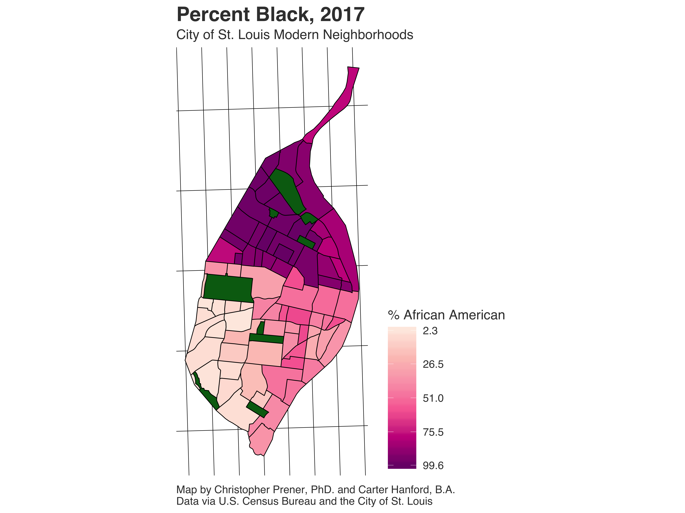

The [*St. Louis Post-Dispatch*](https://www.stltoday.com/news/local/metro/small-church-steps-up-to-help-rebuild-a-broken-north/article_409db978-bfcb-5768-b355-c151a2143da4.html) has published a feature story that includes discussion of data that I've produced for my [redlining research in St. Louis](/project/redlining/). The data that were used in the story are [publicly available](https://github.com/chris-prener/STL_DEMOGRAPHY_NhoodPop) and include a series of maps showing both the changing population density over time in St. Louis as well as the changing racial composition of neighborhoods. These data cover the Decennial Census years 1940 through 2010 as well as the American Community Survey years 2011-2017. These data illustrate stark changes over time. For instance, the image above can be compared to the current distribution of African Americans in St. Louis:

